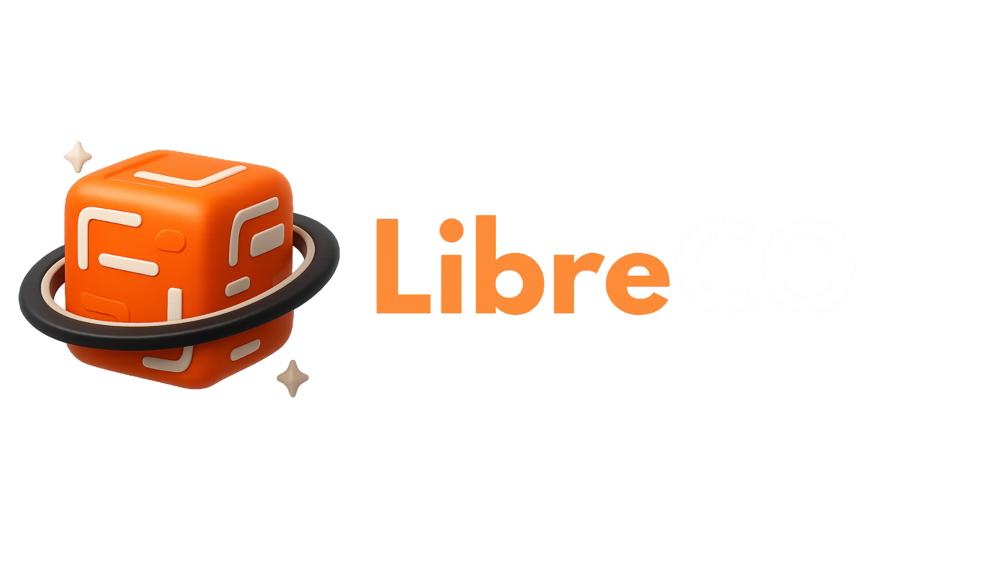

# Libre CO

<p align="center">
  
  <span style="font-size:40px; font-weight:800; vertical-align:middle;">
    <span style="color:#F54927">Libre</span>
    <span style="color:#FFFFFF"> CO</span>
  </span>
</p>

API backend para un ecommerce de ebooks. Gestiona autenticación de usuarios, catálogo de libros, compras y acceso al contenido digital.

## Tecnologías

<p align="center">
  <a href="https://nodejs.org"></a>
  <a href="https://expressjs.com"></a>
  <a href="https://www.mongodb.com"></a>
  <a href="https://mongoosejs.com"></a>
  <a href="https://supabase.com"></a>
  <a href="https://jwt.io"></a>
  <a href="https://joi.dev"></a>
  <a href="https://www.npmjs.com/package/dotenv"></a>
  <a href="https://www.npmjs.com/package/cors"></a>
  <a href="https://nodemon.io"></a>
</p>

## Requisitos
- `Node.js` 18+
- Cuenta y proyecto en `MongoDB Atlas` o instancia local de MongoDB
- Proyecto `Supabase` para autenticación

## Instalación
- Clonar el repositorio y ubicarse en `backend`
- Instalar dependencias: `npm install`

## Configuración
Crear un archivo `.env` en la raíz de `backend` con las variables:

```
PORT=5000
MONGODB_URI=mongodb+srv://<usuario>:<password>@<cluster>/<db>?retryWrites=true&w=majority
JWT_SECRET=<tu_secret_seguro>
SUPABASE_URL=https://<tu-proyecto>.supabase.co
SUPABASE_SERVICE_KEY=<service_role_key>
```

## Ejecución
- Desarrollo: `npm run dev`
- Producción: `npm start`
- Base URL por defecto: `http://localhost:5000`

## Estructura
```
config/              # Conexiones: MongoDB y Supabase
controllers/         # Lógica de negocio (auth, usuarios, libros, compras)
middleware/          # Autenticación, validaciones y permisos
models/              # Modelos Mongoose (User, Book, Purchase)
routes/              # Rutas Express
utils/               # Utilidades
img/                 # Activos de imagen (logo)
server.js            # Bootstrap del servidor
```

## Endpoints principales

### Auth (`/api/auth`)
- `POST /register` Registro con Supabase + persistencia en MongoDB
- `POST /login` Login vía Supabase y emisión de `JWT`
- `GET /profile` Requiere `Authorization: Bearer <token>`
- `POST /logout` Cierre de sesión en Supabase

### Usuarios (`/api/users`)
- `GET /` Listado de usuarios (requiere autenticación)
- `PUT /profile` Actualiza perfil del usuario autenticado

### Libros (`/api/books`)
- `GET /` Lista libros. Query: `categoria`, `promocional`, `page`, `limit`
- `GET /promocionales` Lista de libros en promoción
- `GET /categoria/:categoria` Filtra por categoría
- `GET /:id` Obtiene libro por ID (sin `ebook`)
- `GET /:id/detalles` Incluye `ebook` si el usuario lo compró (requiere token)

### Compras
- Vía libros: `POST /api/books/comprar` crea compra
- Vía libros: `GET /api/books/compras/mis-compras` compras del usuario
- Vía libros: `GET /api/books/:libroId/verificar-compra` verifica compra
- Rutas dedicadas: `POST /api/purchases/`, `GET /api/purchases/`, `GET /api/purchases/check/:libroId`

### Healthcheck
- `GET /api/health` Estado del servicio y conexión a DB

## Payloads y validaciones de compra
- Campo `metodoPago`: `tarjeta` | `paypal` | `transferencia`
- Para `tarjeta` (`cardData`): `numero`, `expiracion` (MM/AA), `cvv`, `nombre`
- Para `paypal` (`paypalData`): `email`
- Para `transferencia` (`transferenciaData`): `referencia`

Validaciones internas:
- Algoritmo de Luhn para tarjetas, formato y CVV
- Email válido para PayPal
- Referencia mínima para transferencia

## Notas de seguridad
- Usa `JWT` para proteger rutas. Envía el token en `Authorization: Bearer <token>`
- No expongas claves de `Supabase` ni `JWT_SECRET` en clientes
- Indiza modelos para rendimiento y evita compras duplicadas

## Scripts
- `npm run dev` Inicia servidor con `nodemon`
- `npm start` Inicia servidor con `node`
